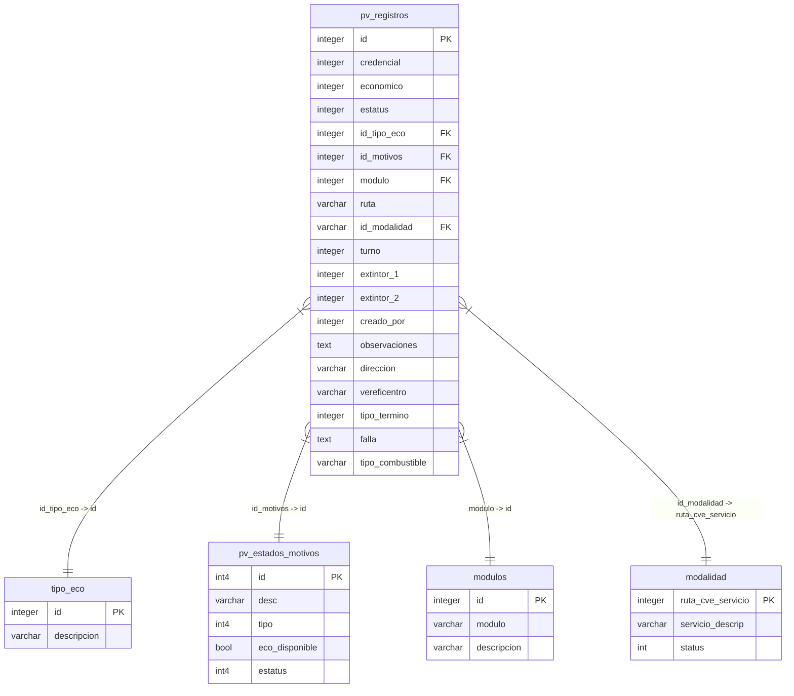
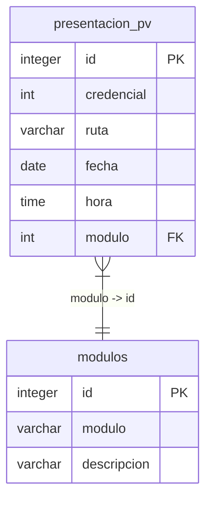
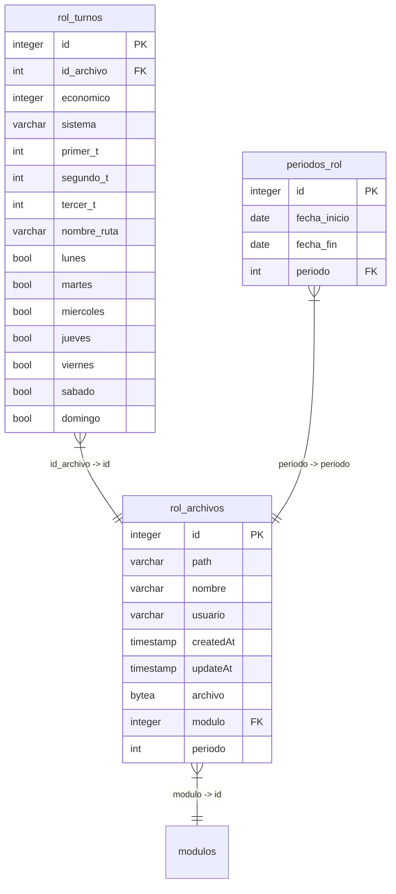

# 📊 Documentación de Base de Datos - SUGO

Este documento describe la estructura, relaciones y diseño del esquema de base de datos utilizado para el sistema **SUGO**.

---

## 🗺️ Diagrama de Relaciones (ERD)

A continuación se muestra de manera visual cómo interactúan las tablas principales en cada módulo.

### 1. Módulo de Despacho


### 2. Módulo de Hora de Presentación


### 3. Módulo de Roles


---

## 📑 Definición Detallada de Tablas (DBML)

A continuación puedes desplegar la definición DBML de cada sección para ver los detalles y tipos de datos precisos.

<details>
<summary>📂 <b>1. Tablas del Módulo Despacho</b> (Click para expandir)</summary>

```dbml
Table pv_registros {
  id integer [primary key]
  credencial integer 
  economico integer 
  estatus integer
  id_tipo_eco integer  [ref: > tipo_eco.id]
  id_motivos integer [ref: > pv_estados_motivos.id] 
  modulo integer [ref: > modulos.id]
  ruta varchar
  id_modalidad varchar  [ref: > modalidad.ruta_cve_servicio]
  turno integer
  extintor_1 integer
  extintor_2 integer
  creado_por integer
  observaciones text
  direccion varchar
  vereficentro varchar
  tipo_termino integer
  falla text
  tipo_combustible varchar
}

Table modulos {
  id integer [primary key]
  modulo varchar
  descripcion varchar
}

Table pv_estados_motivos {
  id int4 [primary key, increment] 
  desc varchar(255)
  tipo int4
  eco_disponible bool
  estatus int4
  createdAt timestamptz
  updatedAt timestamptz
  createdBy int4
  updatedBy int4
  prev_values json
}

Table tipo_eco {
  id integer [primary key]
  descripcion varchar
}

Table modalidad {
  ruta_cve_servicio integer [primary key]
  servicio_descrip varchar
  status int
}
```
</details>

<details>
<summary>📂 <b>2. Tablas del Módulo Hora de Presentación</b> (Click para expandir)</summary>

```dbml
Table presentacion_pv {
  id integer [primary key]
  credencial int
  ruta varchar
  fecha date
  hora time
  modulo int [ref: > modulos.id]
}
```
</details>

<details>
<summary>📂 <b>3. Tablas del Módulo Rol</b> (Click para expandir)</summary>

```dbml
Table rol_archivos {
  id integer [primary key]
  path varchar
  nombre varchar
  usuario varchar
  createdAt timestamp
  updateAt timestamp
  archivo bytea
  modulo integer [ref: > modulos.id]
  periodo int
}

Table rol_turnos {
  id integer [primary key]
  id_archivo int [ref: > rol_archivos.id]
  economico integer
  sistema varchar
  primer_t int
  segundo_t int
  tercer_t int
  createdat timestamp
  updatedat timestamp
  nombre_ruta varchar
  lunes bool
  martes bool
  miercoles bool
  jueves bool
  viernes bool
  sabado bool
  domingo bool
}

Table rol_turnos_edit {
  id integer [primary key]
  id_archivo int 
  economico integer
  sistema varchar
  primer_t int
  segundo_t int
  tercer_t int
  createdat timestamp
  updatedat timestamp
  nombre_ruta varchar
  lunes bool
  martes bool
  miercoles bool
  jueves bool
  viernes bool
  sabado bool
  domingo bool
}

Table rol_turno_lv {
  id serial [pk]
  ideconomico int
  hora_inicio_1 time
  hora_inicio_cc_1 time
  lugar_inicio_1 varchar
  hora_termino_turno_1 time
  lugar_inicio_2 varchar
  hora_inicio_2 time
  hora_termino_turno_2 time
  lugar_inicio_3 varchar
  hora_inicio_turno_3 time
  hora_termino_cc_t time
  lugar_termino_cc_t varchar
  termino_modulo_t time
  termino_turno_t time
  id_archivo int
  nombre_ruta varchar
}

Table rol_turno_sab {
  id serial [pk]
  ideconomico int
  hora_inicio_1 time
  hora_inicio_cc_1 time
  lugar_inicio_1 varchar
  hora_termino_turno_1 time
  lugar_inicio_2 varchar
  hora_inicio_2 time
  hora_termino_turno_2 time
  lugar_inicio_3 varchar
  hora_inicio_turno_3 time
  hora_termino_cc_t time
  lugar_termino_cc_t varchar
  termino_modulo_t time
  termino_turno_t time
  id_archivo int
  nombre_ruta varchar
}

Table rol_turno_dom {
  id serial [pk]
  ideconomico int
  hora_inicio_1 time
  hora_inicio_cc_1 time
  lugar_inicio_1 varchar
  hora_termino_turno_1 time
  lugar_inicio_2 varchar
  hora_inicio_2 time
  hora_termino_turno_2 time
  lugar_inicio_3 varchar
  hora_inicio_turno_3 time
  hora_termino_cc_t time
  lugar_termino_cc_t varchar
  termino_modulo_t time
  termino_turno_t time
  id_archivo int
  nombre_ruta varchar
}

Table periodos_rol {
  id serial [pk]  
  fecha_inicio date
  fecha_fin date
  periodo int [ref: > rol_archivos.periodo]
}
```
</details>